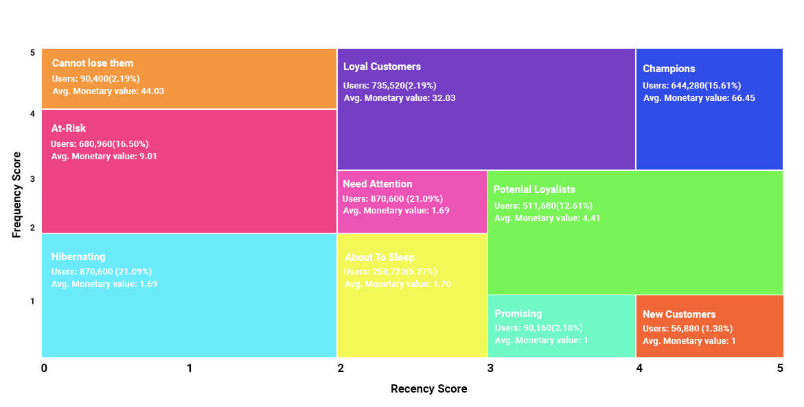

# Project-Live
The goal is to focus marketing communications to the most profitable clientele while improving customer service.

# RFM Analysis for the Purpose of Customer Segmentation

Using RFM Analysis, I segmented our clients for this project.

RFM stands for Recency,Frequency and Monetary

**Recency**: How much time has passed since the last interaction or transaction a client had with the brand? Activity is often a purchase, although there are exceptions, such as the most recent visit to a website or usage of a mobile application. More often a client has engaged or transacted with a brand, the more likely he or she is to be receptive to messages from that brand.

**Frequency**: How often has a consumer transacted with or engaged with the brand over a certain time frame? Clearly, clients who participate in regular activities are more engaged and likely more loyal than those who do so seldom. One-time clients are in a class by themselves.

**Monetary**: This element, often known as "monetary value," represents how much a client has spent with the brand over a certain time period. Customers who spend more should often be handled differently than those who spend less. The average buy amount is an essential secondary aspect to consider when segmenting clients, which can be determined by dividing monetary by purchase frequency.
